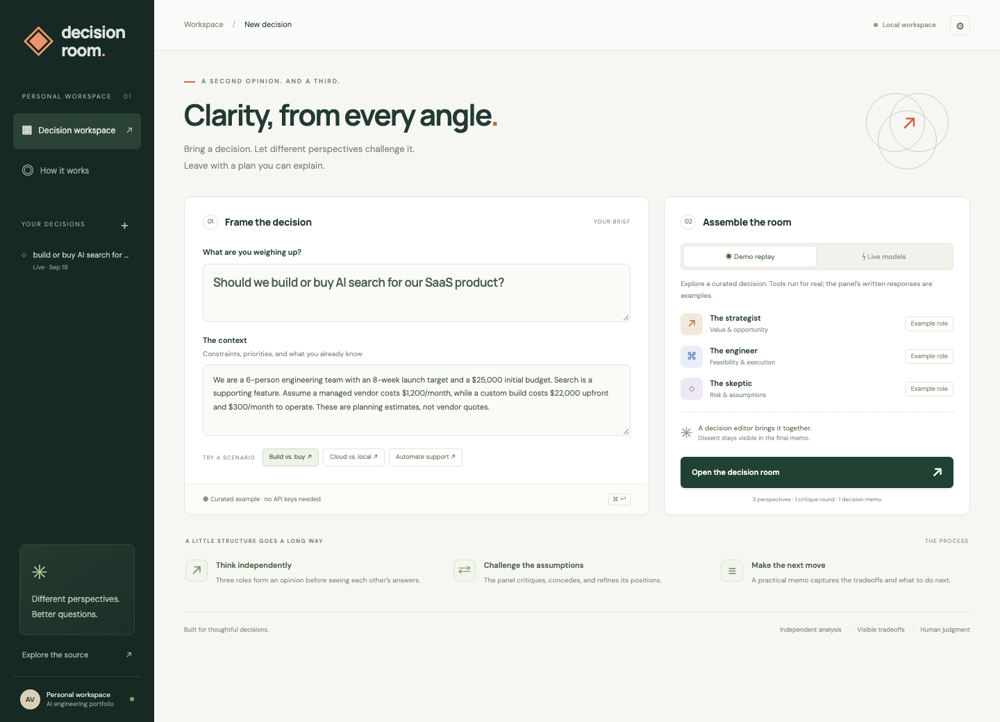
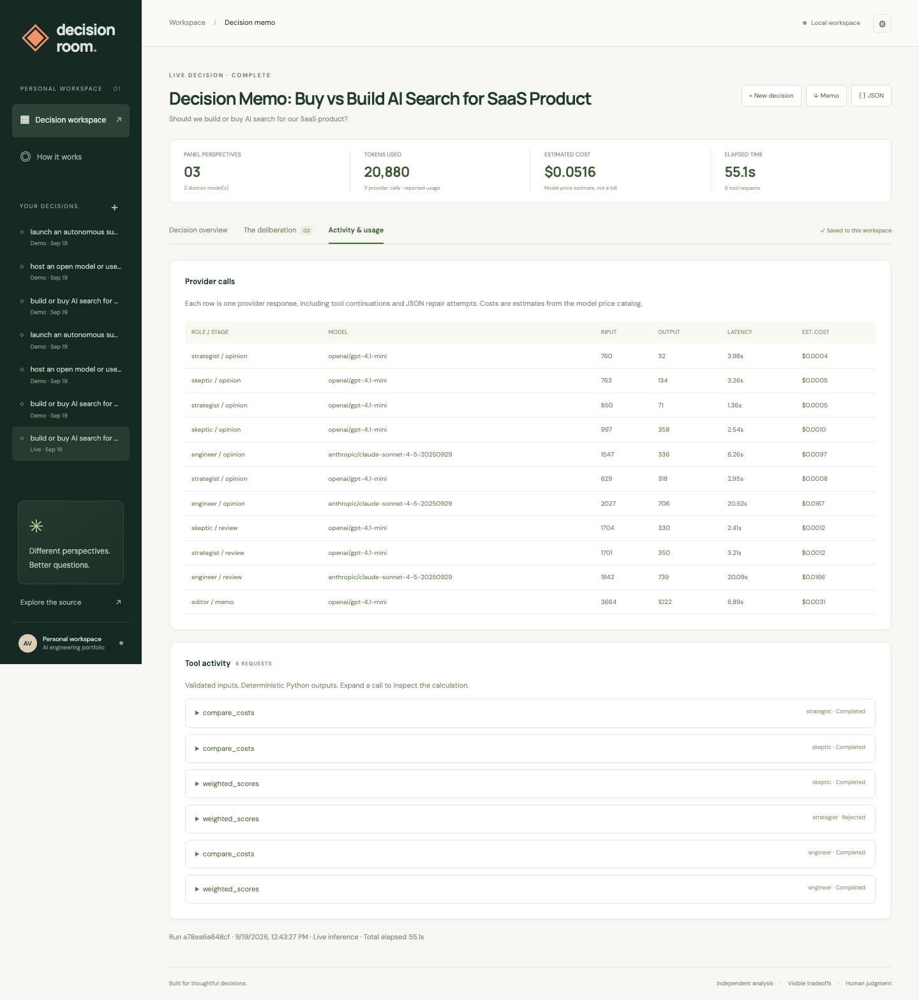
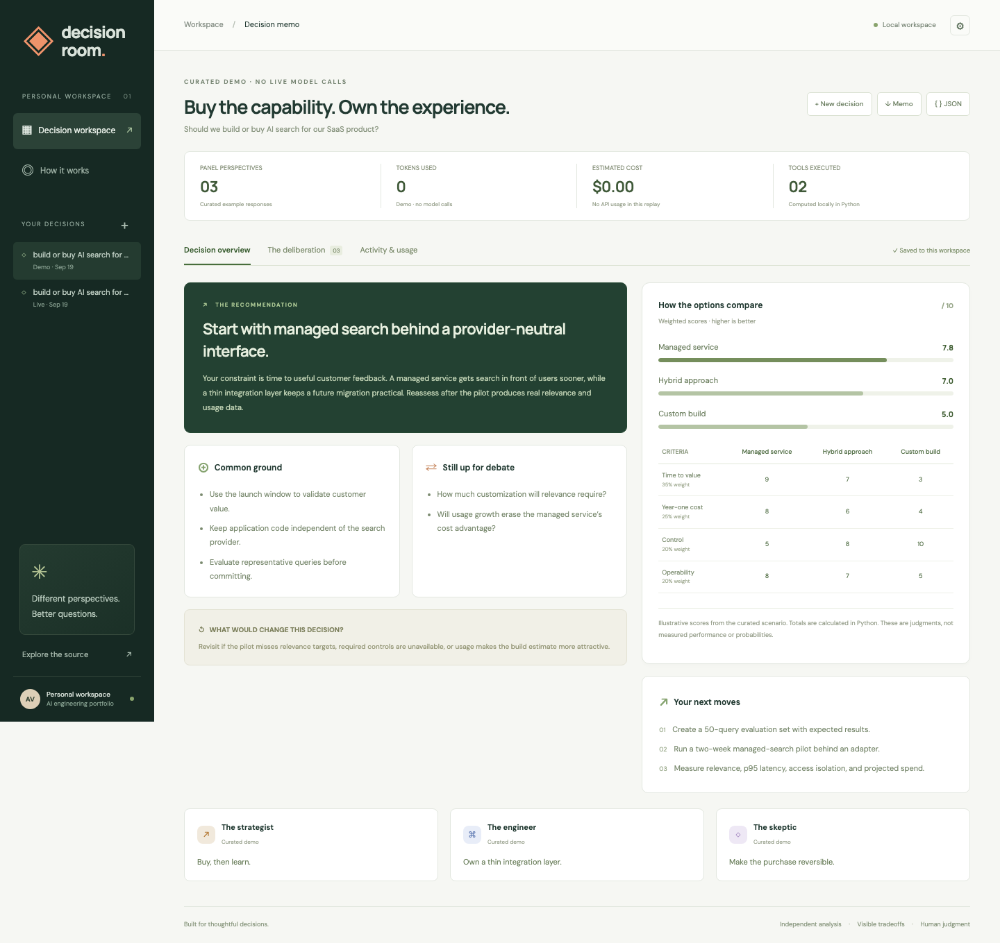
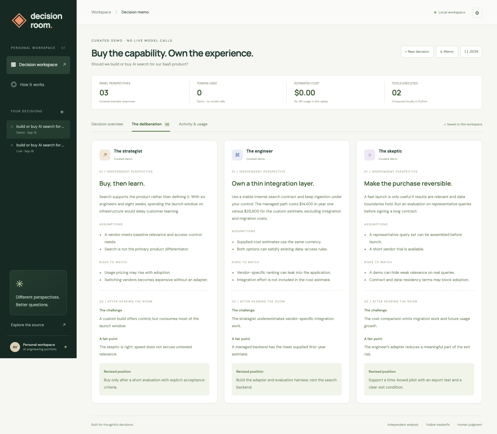
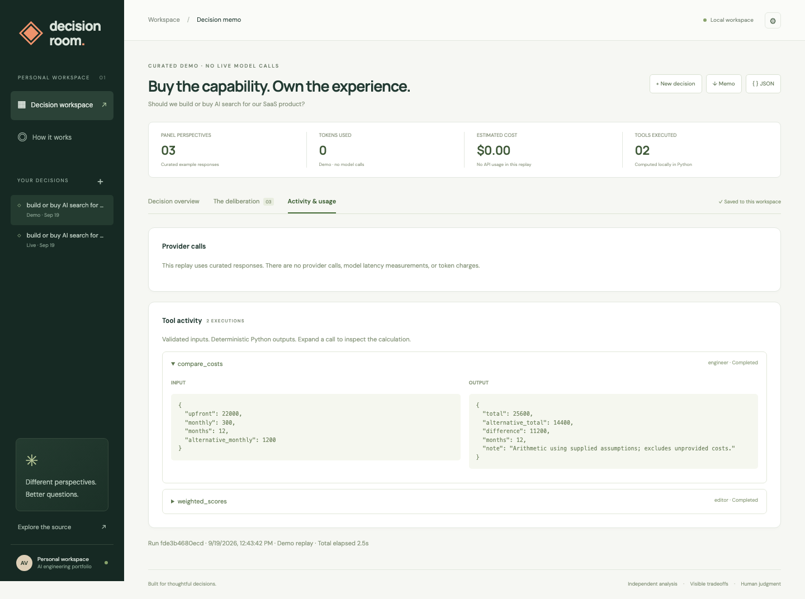
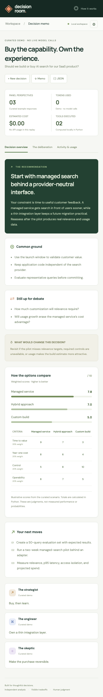

<div align="center">

# Decision Room

**Three perspectives. One decision you can explain.**

A multi-model workspace that turns a technical tradeoff into independent opinions, a critique round, and an actionable decision memo.

[](https://github.com/anilvarma-kav/ai-decision-room/actions/workflows/ci.yml)


[Get started](#run-it-locally) · [Real results](#a-real-run) · [Architecture](docs/architecture.md) · [Evaluation](docs/evaluation.md)

</div>



## Why I built this

A single fluent answer can hide the assumptions behind a recommendation. I wanted a way to examine a decision from several roles, challenge their positions, and keep the disagreement visible alongside the final answer.

The interesting engineering problem is coordinating those calls reliably: preserving context between stages, executing tools safely, validating model output, handling a missing panelist, and showing what the run actually cost.

This project extends my Week 2 LLM engineering work into a standalone application with a Python API, a responsive interface, persistent results, and automated checks.

## What it does

- **Independent perspectives:** a strategist, an engineer, and a skeptic analyze the same brief before seeing each other’s answers.
- **A bounded critique round:** each role challenges a point, acknowledges a useful argument, and revises its position.
- **A structured memo:** the editor records a recommendation, common ground, unresolved disagreements, next actions, and conditions for revisiting the decision.
- **Real tools:** cost comparison and weighted scoring use validated Python functions. Scores and weights remain subjective; arithmetic is deterministic.
- **Observable runs:** progressive panel updates, per-call tokens and latency, estimated cost, tool inputs and outputs, and explicit failed stages.
- **Portable results:** a local SQLite journal, Markdown memos, and a JSON audit record.

Choose OpenAI, Anthropic, Gemini, or a local Ollama model for each role. One configured provider is enough to run all three roles. The editor reuses a model that successfully produced an initial opinion. Roles are different perspectives; selecting the same model does not make them independent sources of evidence.

## Run it locally

Requires Python 3.11+ and [uv](https://docs.astral.sh/uv/getting-started/installation/).

```bash
git clone https://github.com/anilvarma-kav/ai-decision-room.git
cd ai-decision-room
uv sync --frozen --no-dev
uv run --no-dev uvicorn decision_room.app:app --host 127.0.0.1 --port 7860
```

Open **[localhost:7860](http://localhost:7860)**. The demo needs no API keys. Pick a scenario and open the room.

**Demo replay is deliberately labeled.** Its panel responses are curated fixtures, its Python calculations execute locally, and its token count and API cost are zero. Editing a brief requires live mode. A failed live run never silently becomes a demo result.

### Use live models

```bash
cp .env.example .env
```

Set `ENABLE_LIVE=1` and add at least one provider key to `.env`, then restart the server. Click **Live models**, choose the provider for each role, and enter a brief. Model IDs can be overridden with `MODEL_OPENAI`, `MODEL_ANTHROPIC`, `MODEL_GEMINI`, and `MODEL_OLLAMA`.

For Ollama, set `ENABLE_OLLAMA=1` and choose a tool-capable installed model. `OLLAMA_API_BASE` defaults to `http://localhost:11434`. The OpenAI and Anthropic paths have been tested against real APIs; Gemini and Ollama are configurable adapters and have not been live-verified in this repository’s recorded run.

Keys stay on the server. Live runs incur provider charges. Set `ROOM_API_TOKEN` before exposing live mode to a network; enter that token in the workspace settings. This application is designed for one personal workspace and one server worker.

### Docker

```bash
docker build -t decision-room .
docker run --rm -p 127.0.0.1:7860:7860 \
  -v decision-room-data:/app/data decision-room
```

The container runs as a non-root user. Pass `--env-file .env` to enable configured live providers. If using Ollama from Docker Desktop, set its base URL to `http://host.docker.internal:11434`.

## A real run

The repository includes an actual mixed-provider run for **“Should we build or buy AI search for our SaaS product?”** using GPT-4.1 mini for the strategist, skeptic, and editor, and Claude Sonnet 4.5 for the engineer.

| Observation                                  |           Recorded result |
| -------------------------------------------- | ------------------------: |
| Successful panel perspectives                |                         3 |
| Distinct models                              |                         2 |
| Provider calls, including tool continuations |                        11 |
| Reported input + output tokens               |                    20,880 |
| Tool requests                                | 6: 5 accepted, 1 rejected |
| Failed deliberation stages                   |                         0 |
| Wall-clock duration                          |              55.1 seconds |
| Estimated provider cost                      |                   $0.0516 |

One invalid scoring request was rejected and returned to the model as a tool error. The run continued and produced a valid memo. The rejected request’s original arguments were not retained by that version; subsequent runs preserve them, covered by a regression test.

These are observations from one run, not a speed, price, or accuracy benchmark. Prices are estimates from the model catalog. Provider latency and outputs vary.

[Read the actual memo](examples/live-search.md) · [Inspect its JSON record](examples/live-search.json)



## The experience

The demo memo makes the tradeoffs easy to scan. Every screenshot below was captured from the running application with Playwright; demo and live provenance are visible in the interface.



<details>
<summary><strong>See the critique round, tool inspection, and mobile layout</strong></summary>

### Independent opinions and peer critique



### Inspect the calculation



### Mobile



</details>

## Engineering decisions

| Concern               | Implementation                                                                                      |
| --------------------- | --------------------------------------------------------------------------------------------------- |
| Provider integration  | LiteLLM behind an injectable async completion function; server-owned model allowlist                |
| Orchestration         | Explicit analysis → review → synthesis stages using `asyncio`; parallel calls within a stage        |
| Structured generation | Pydantic schemas, one bounded format-repair attempt, and matrix consistency checks                  |
| Tool use              | Named registry, schema validation, finite numeric bounds, no arbitrary code execution               |
| Stream transport      | Server-sent events over a POST response; completed stage outputs stream as they arrive              |
| Reliability           | Per-request deadlines, total run deadline, cancellation propagation, and disclosed partial failures |
| Observability         | Tokens from provider responses; unknown usage/pricing stays unknown                                 |
| Persistence           | SQLite with parameterized queries; completed memos only                                             |
| Frontend              | Plain JavaScript and CSS; responsive layouts, keyboard navigation, escaped model text               |
| Delivery              | Locked dependencies, tests, browser checks, GitHub Actions, and a non-root Docker image             |

I used an explicit orchestration loop so the state transitions, request limits, and failure behavior are easy to inspect. I chose a custom frontend to make the decision memo, critique, and audit trail separate views. The interface does not require a JavaScript build toolchain.

The stream emits validated responses and lifecycle events, not token-by-token model output. This trades immediate text generation for complete, schema-checked cards. See [the architecture notes](docs/architecture.md) for the request limits, cancellation behavior, and other tradeoffs.

## Verify it

```bash
uv sync --frozen
uv run ruff check .
uv run ruff format --check .
uv run pytest -q
uv run python scripts/evaluate.py
```

The automated suite covers tool bounds, JSON repair, tool-loop limits, rejection recovery, provider failure, cancellation, authentication, persistence, and export provenance. The offline evaluation checks output contracts and reproducible arithmetic; it does not assess whether a recommendation is correct.

With the app running in another terminal:

```bash
uv run playwright install chromium
uv run python scripts/check_ui.py
```

This exercises all three scenarios, the critique view, tool inspection, both downloads, history, cancellation, dialogs, and mobile overflow. To regenerate the demo screenshots:

```bash
uv run python scripts/check_ui.py --output docs/screenshots
```

Live screenshots come from the recorded real run and are not regenerated by the demo script. [Evaluation notes](docs/evaluation.md) describe the checks and the remaining quality questions.

## Project map

```text
decision_room/
  app.py             API, authorization, SSE, and run lifecycle
  engine.py          Bounded multi-model orchestration
  models.py          Input and output contracts
  prompts.py         Role definitions and synthesis instructions
  tools.py           Validated cost and scoring functions
  storage.py         SQLite journal
  export.py          Markdown report generation
  demo.py            Deterministic, labeled replay
  fixtures/          Three curated scenarios
  static/            Browser application
examples/            A real mixed-provider result and its audit record
tests/               Unit and API integration tests
scripts/             Browser checks and offline contract evaluation
docs/                Architecture, evaluation, and actual screenshots
```

## What this does not establish

Multiple models can share the same blind spots. The application does not research or verify facts on the web, and its option scores are not calibrated confidence estimates. The current tests establish software behavior, not improved decision quality over a single-model baseline.

The next useful experiment is a blind comparison against a single-model baseline on a fixed set of decisions, with human scoring for constraint adherence, unsupported claims, preserved dissent, and usefulness of next actions. Production hosting would also require per-user isolation, shared concurrency control, stronger spend controls, and operational monitoring.

## License

[MIT](LICENSE)
