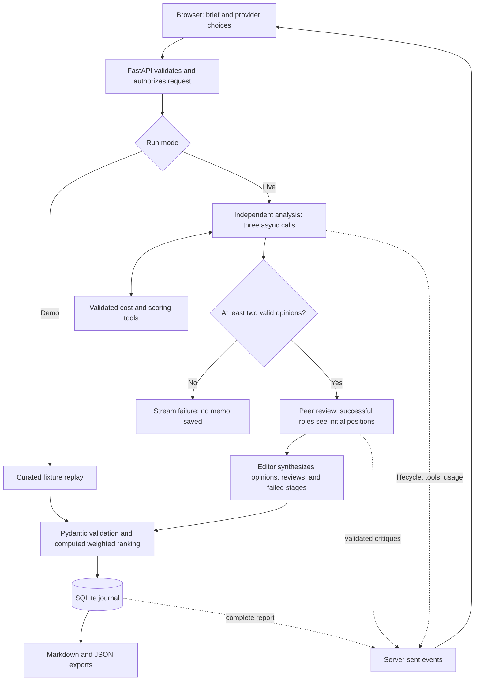

# Architecture and tradeoffs

The system makes one bounded deliberation easy to inspect. It uses three role calls, a peer critique round, and an editor. It does not rely on an autonomous agent framework.



## The contracts

`DecisionRequest` accepts a question, supporting context, mode, scenario, and three provider IDs. Provider IDs resolve against server configuration; the browser cannot send a model endpoint or an arbitrary model name.

An `Opinion` has a recommendation, a concise rationale, assumptions, and risks. A `Review` has a challenge, a concession, and a revised position. A `Memo` carries the final recommendation, points of agreement, disagreement, next actions, a revisit condition, and a comparison matrix.

Outputs are parsed as JSON and validated with Pydantic. Extra keys, non-finite numbers, out-of-range scores, duplicate matrix names, and inconsistent row lengths are rejected. An invalid output receives one repair instruction within the request cap. Persistent invalid output ends that stage.

## Context flow

Initial role prompts receive only the user brief. They run concurrently and do not see another role’s answer. Each peer review receives the same set of successful initial opinions. Reviews also run concurrently; they do not recursively debate each other.

The editor receives the original brief, initial opinions, completed critiques, and failure notices. It uses a provider that returned a valid initial opinion. Its structured memo must retain disagreement and state what would change the decision.

The prompts request concise, user-facing explanations rather than private reasoning traces. Multiple roles using the same model are disclosed as one distinct model.

## Tools and arithmetic

`compare_costs` calculates upfront plus monthly costs over a supplied horizon. Every amount must use the same currency. Unprovided integration, maintenance, migration, and opportunity costs remain absent; the tool does not estimate them.

`weighted_scores` validates a matrix and computes:

```text
option score = sum(criterion weight × option rating) / sum(criterion weights)
```

Ratings are in `[0, 10]`, with higher values always better. Positive weights are normalized automatically. The final memo’s ranking is computed in application code even when no model requested the scoring tool.

A named registry is the only execution surface. There is no `eval`, shell command, URL fetch, or arbitrary file access. Invalid requests become tool error messages that the model may recover from within its existing call budget. Tool records retain inputs and outputs, including rejected inputs.

## Limits and failures

| Boundary                | Limit / behavior                                                             |
| ----------------------- | ---------------------------------------------------------------------------- |
| Brief                   | 2,000 characters for the question; 6,000 for context                         |
| Initial analysis        | At most 3 provider requests per role, including continuations and repair     |
| Critique                | At most 2 provider requests per successful role                              |
| Editor                  | At most 2 provider requests                                                  |
| Total provider requests | At most 17 per run; provider retries disabled                                |
| Tool batches            | At most 4 tool requests per response; at most 2 tool rounds per initial role |
| Output                  | At most 1,800 requested output tokens per provider request                   |
| Request deadline        | 55-second provider timeout, wrapped in a 60-second async timeout             |
| Run deadline            | 5 minutes                                                                    |
| Concurrency             | One active run per server process; three roles can execute concurrently      |
| Partial initial failure | Continue with two successful roles and disclose the missing perspective      |
| Fewer than two opinions | Abort; do not synthesize a result                                            |
| Failed critique         | Disclose the missing stage to the editor and in the result                   |
| Failed editor           | Abort; no memo saved                                                         |
| Browser disconnect      | Cancel the producer and outstanding async provider tasks                     |

These are workload limits, not a dollar spending guarantee. Providers can charge for requests processed before a cancellation or timeout. A provider failure may have unknown usage; completed-response costs are not a complete invoice for aborted runs.

## Streaming

The browser POSTs a request and reads its `text/event-stream` response using `fetch` and a streaming decoder. The server sends named JSON event types, with heartbeat comments during quiet periods. Each completed perspective and critique appears in the interface as it arrives.

The engine is transport-independent: it receives an async event callback. Tests inject a fake completion function and collect its events without making paid requests.

There is no token-by-token rendering. Complete responses are validated first, then streamed as structured cards. This keeps partially formed JSON out of the interface.

## Storage and access

The SQLite journal saves completed reports with a generated ID and a UTC creation timestamp. Each operation uses a separate connection and parameterized SQL. History exposes the 30 most recent results. Aborted runs are not saved.

The default bind address is localhost. Optional bearer authentication protects run creation, history, and exports. The browser holds that token in memory only. POST requests with a foreign Origin are rejected. Provider credentials never enter browser responses or committed fixtures.

This is a personal workspace. The in-process concurrency flag requires one worker. Multi-user production hosting would need per-user records, a shared queue, durable run state, access controls, and a provider-side budget policy. A bearer token is not a multi-user authentication system.

## Frontend

The browser application has no runtime JavaScript framework. Model and user strings are escaped before insertion into templates. Tab controls support arrow keys, focus states are visible, forms have labels, and the layout reflows to a 390-pixel mobile viewport. Fonts are loaded from Google Fonts with system fallbacks.

The browser checks exercise real HTTP routes. Screenshots are captured directly from the rendered application; they are not design mockups.

## Technical references

- [LiteLLM function calling](https://docs.litellm.ai/docs/completion/function_call) for provider-neutral tool messages.
- [LiteLLM usage](https://docs.litellm.ai/docs/completion/usage) for reported token accounting.
- [FastAPI streaming responses](https://fastapi.tiangolo.com/advanced/custom-response/) for the event transport.
